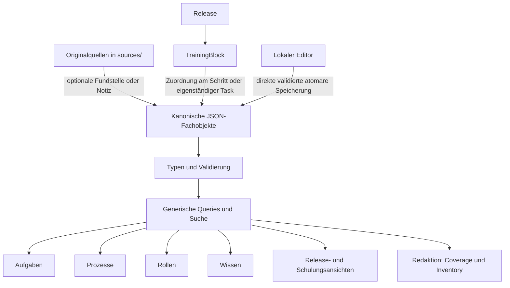

# Aktuelle Architektur

Das Center ist eine lokale, statische Wissens- und Arbeitshilfe. JSON enthält die führenden Fachinformationen; TypeScript beschreibt Verträge, validiert Beziehungen und berechnet Sichten. React stellt diese Sichten dar. Git führt die technische Versionshistorie. SQLite und ein fachlicher Audit-Trail sind nicht Bestandteil der Anwendung.

## Datenfluss



## Führende Dateien

| Bestand                                 | Verantwortung                                                                                                                                                                    |
| --------------------------------------- | -------------------------------------------------------------------------------------------------------------------------------------------------------------------------------- |
| `src/content/articles/<id>.json`        | Artikeltext, Zielrollen/-systeme, Status, optionale Grenzen und Quellenhinweise                                                                                                  |
| `processes.json`                        | Ein vollständiger Prozessbestand; Prozess mit geordneten Schritten, Verantwortungsrollen, Ein-/Ausgängen, Schulungszuordnung und expliziten Materialbeziehungen                  |
| `tasks.json`                            | 19 bestehende fachliche Arbeitsaufgaben, die in verschiedenen Materialien/Kontexten verwendet werden, sowie zwei vorhandene Handbuchthemen ohne erfundene Matrix-/Blockzuordnung |
| `procedures.json`                       | 25 eindeutig identifizierte Bedienwege; Handlungen, Voraussetzungen und Ergebnisprüfung nur hier                                                                                 |
| `roles.json`, `systems.json`            | Ein gemeinsamer Rollenbestand und fünf zentrale Systeme mit untergeordneten konkreten Bedienzielen und bisherigen Tool-IDs                                                       |
| `releases.json`, `training-blocks.json` | Release-Kontexte und beliebig viele zugehörige Schulungsblöcke                                                                                                                   |
| `topics.json`                           | 67 unterscheidbare offizielle Scope-/Funktionsreferenzen; keine Prozessschritte oder ausführbaren Aufgaben                                                                       |
| `open-points.json`                      | Wenige gemeinsam verwendete offene Punkte; normale lokale Punkte sind einfache Strings am Fachobjekt                                                                             |
| `sources.json`                          | Optionaler leichter Quellenkatalog mit Titel/Pfad/Datum; keine Runtime-Hashes                                                                                                    |
| `help.json`                             | Lokale Plattformhilfe                                                                                                                                                            |

Die offiziellen Scope- und Funktionsreferenzen haben teilweise einen breiteren Umfang als ein Arbeitsweg. Sie werden deshalb als generische Wissensthemen erhalten und können über `whole`, `partial` oder `prerequisite` verbunden werden. Diese Beziehungen sind keine Identitätszuordnung. Die acht früheren CAP-Gruppierungen sind archiviert. `Inventory` pflegt keine weiteren Titel, Zustände oder Materialien.

`src/content/types.ts` definiert die Typen. `validation.ts` prüft JSON-Form, erlaubte Felder, global eindeutige IDs, gültige Rollen/Systeme/Beziehungen, Material-/Procedure-Zuordnung und Releasegültigkeit. `relationships.ts` löst navigierbare fachliche Relationship-Ziele gemeinsam für Validierung und Renderer auf: Artikel, Tasks, ProcessSteps, Topics und Procedures mit Titel und passender Route. Andere existierende IDs werden in diesen Kontexten zurückgewiesen. Procedure-Materialzuordnungen prüfen zusätzlich die kanonische fachliche Aufgabe: `Procedure.taskId` muss zum Task bzw. zu den `taskIds` des Schritts passen. Bewusste Wiederverwendung erfolgt über diese expliziten Beziehungen, ohne zusätzliche Mappingtabelle.

Die Validierung gilt für Build, Reader-Initialisierung und Editor-Speicherung. `index.ts` lädt Artikel automatisch über Vites JSON-Glob; der Editor lädt aktuelle Dateien direkt über `scripts/content-model.ts`.

## Prozesse und Schulungen

Der vollständige Bestand hat **52 stabile ProcessStep-IDs**: 24 SB01-Schritte, 27 SB02-Schritte und den vorhandenen Abschlussschritt `step-5-1`. Letzterer hat keine belegte Release- oder Schulungszuordnung und erhält deshalb keine.

`release-1` bleibt der R1-Kontext. `sb1` behält seine stabile ID und wird als **SB01** angezeigt; `sb2` ist **SB02** desselben Releases. R1B bleibt ein gesonderter Planungs-/Geltungskontext. Weitere Releases und Blöcke werden allein durch JSON-Daten ergänzt, ohne neue Coverage-Dateien oder Query-Sonderfälle. Globale Block-IDs müssen eindeutig sein, Anzeigecodes dürfen über Releases wiederkehren.

Artikel enthalten keine TrainingBlock-Zuordnung. `getArticleContext()` leitet den Schulungsbezug ausschließlich aus gültigen Materialbeziehungen an Schritten und eigenständigen Aufgaben ab. Eine Schrittzuordnung zu R3 erweitert die Gültigkeit eines R1-Artikels nicht.

## Materialien und Coverage

Eine Materialbeziehung enthält `articleId`, `kind`, explizite `releaseIds` und optional `procedureIds`:

- `guide`: Anleitung für einen begrenzten Arbeitsweg; konkrete Procedure-IDs nur bei passendem Inhalt.
- `orientation`: Vorbereitung oder Einordnung, kein ausführbarer Gesamtweg.
- `reference`: ergänzender Beitrag oder breitere Quellen-/Scope-Orientierung.

Ein Artikel kann für unterschiedliche Aufgaben unterschiedliche Zwecke erfüllen. Die Orientierung zu Antrag/PMO-Bereitstellung übernimmt insbesondere nicht den PM-Übernahmebedienweg als ausführbaren Gesamtweg.

`getTrainingBlockCoverage(blockId)` sammelt zugeordnete Schritte/Tasks, löst Materialien auf und berechnet Materialarten, Artikelstatus, offene Punkte, fehlendes Material, vorhandene Procedures und Releasegültigkeit. Die Query besitzt keine SB01-/SB02-/R3-/R4-Sonderlogik. `hasUsableGuide` beschreibt nur einen nutzbaren begrenzten Bedienweg; es gibt kein Feld, das daraus vollständige Prozessabdeckung oder technische Freigabe behauptet.

`getInventory()` projiziert vorhandene Artikel, Schritte, Aufgaben, Themen, Procedures, Prozesse, Rollen, Systeme, Releases und Blöcke. `searchContent()` durchsucht diesen selben Bestand und die Inhalts-/Bedientexte. Rollen- und Prozessansichten verwenden dieselben Fachobjekte. Sichten sind keine zweite fachliche Wahrheit. Verknüpfte Aufgaben übernehmen ihre Materialien generisch aus Prozessschritten. Nur eigenständige oder zusätzliche fachlich unterschiedliche Lesebeziehungen werden direkt an Tasks gepflegt. Scope-Themen übernehmen ergänzende Referenzen aus den bestehenden whole-/partial-Beziehungen; prerequisite erweitert die Materialabdeckung nicht. Keine doppelte Materialpflege zwischen Schritt, Task und Scope-Sicht. Frühere generische Inventory-Texte wie „noch kein Bedienweg“ werden nicht als manuelle offene Punkte kopiert; fehlendes Material entsteht aus der Query. Konkrete WBS-, Abschluss- und Freigabegrenzen bleiben als fachliche Punkte erhalten.

## Status, offene Punkte und Quellen

Es gibt ausschließlich `draft`, `usable`, `approved` als Artikelstatus. Die fünf zuvor als begrenzt nutzbar beschriebenen Beiträge sind `usable`; die elf anderen sichtbaren Beiträge bleiben `draft`. Keine alte Feldbestätigung wird als vollständige Artikel-Freigabe interpretiert. `approved` bezeichnet ausschließlich eine Freigabe im Knowledge Center.

Normale Grenzen stehen als `openPoints: string[]` am betroffenen Fachobjekt. Gemeinsam geltende tatsächliche offene Fragen können einmal in `open-points.json` gepflegt und mit `openPointIds` referenziert werden. Es gibt keine Issue-Zustände, Pflegefälle, parallele Readiness-Einträge oder Assessment-Objekte. Noch relevante Unsicherheiten aus den CareCases sind hier übernommen; die ursprünglichen Entscheidungen sind archiviert.

Quellenangaben sind optional: freie `sourceRefs` oder `sourceNote` genügen. Nützliche bestehende Fundstellen sind übernommen. Alle zwölf Originaldateien in `sources/` bleiben unverändert. Technische SHA-256-Prüfungen sind nur Bestandteil der Migrationstests, nicht der Inhaltspflege oder Nutzeroberfläche.

## Editor und Persistenz

Der lokale Editor arbeitet auf kanonischen JSON-Dateien. Zulässige Collection-Namen und Artikelpfade werden serverseitig bestimmt; beliebige Client-Dateipfade werden nicht akzeptiert. Loopback-Bindung, Host-/Origin-/Token-Prüfung, Größenlimit, Schema-/Referenzvalidierung, Schutz bestehender IDs, exklusive Schreibsperre, vollständiger JSON-Bestandsfingerprint und atomare Dateiersetzung schützen die Speicherung. Unter Windows bleibt die Speicherung bei synchronisierter Datei und atomarem Rename; Unix synchronisiert zusätzlich das Verzeichnis.

Strukturell ungültige Entwürfe bleiben vollständig in der JSON-Ansicht erhalten; Formulare setzen passende Feldtypen voraus. Eine sitzungslokale Dirty-Prüfung schützt Hauptnavigation, interne Routenwechsel, Objektwechsel und erneutes Laden mit Speichern/Verwerfen/Abbrechen. `beforeunload` schützt Reload und Schließen im Rahmen der Browsermöglichkeiten. Es gibt keine zusätzliche Entwurfspersistenz. Bei Konflikten bleiben Eingaben im Formular erhalten. Aktueller Dateistand kann separat verglichen werden. Es gibt kein Journal, Replay, Overlay, künstliches Article-Objekt, Registry oder `Object.defineProperty`-Spiegelung. Ein Save erzeugt keinen Git-Commit. Ungespeicherte/noch nicht committete Änderungen sind noch keine Git-Historie.

Der Reader wird lokal gebaut und ausgeliefert. Der gebaute Editor nutzt die aktuellen Repository-JSON-Dateien beim Start und nach Save; nach Änderungen muss der Reader neu gebaut werden. Vite-Editor und gebauter Editor verwenden denselben Speicherhandler.

Browserdaten bleiben in `ippm-learning-v1`, Version 1: Merkliste, Lesemarkierungen und opaque historische `passed`-Werte. Unbekannte IDs bleiben erhalten, obwohl die neun Demoartikel, drei Lernpfade und zwei Demo-Prozesse nicht mehr im Runtime-Bestand sind. Reale Altlinks bleiben wirksam: `/prozesse?q=...` verwendet die gemeinsame Suche, `/wissen?rolle=...` den kanonischen Rollenfilter; die alten Themen-/Formatparameter `thema` und `format` filtern weiterhin die Artikelmetadaten. Kanonisches `role` hat Vorrang; beim Ändern des Rollenfilters wird `rolle` entfernt.

Die bisherigen 16 Artikel-URLs, 52 Schritt-IDs, 25 Procedure-IDs und vier fachlichen Role-IDs bleiben stabil.

## Repository und Verifikation

```text
src/content/       JSON, Typen, Validierung, Ladepunkt
src/lib/           Queries, Suche, Prozesslayout und sitzungslokale Prozessnavigation
src/hooks/         React-Zustand und Aktionen für den Lernfortschritt
src/services/      versioniertes Laden, Speichern und Zusammenführen des Lernfortschritts
src/types/         gemeinsamer Progress-Vertrag für Hook, Speicherung und Darstellung
src/components/    gemeinsame Inhalts- und UI-Bausteine
src/pages/         Aufgaben, Prozesse, Rollen, Wissen, Schulungen, Persönliches, Hilfe
src/editor/        direkter JSON-Editor und abgeleiteter Bestand
scripts/           Content-Loader, Speicherhandler, Editor-Build/-Server, Windows-Start
sources/           unveränderte Originalquellen
docs/              Architektur, Inhaltspflege, aktuelle Roadmap
docs/archive/      historische Releases, Entscheidungen und Migrationsbericht
tests/             Integrität/Migration, Reader, Editor-API und Browserbedienung
```

Die Tests sichern Fachverhalten und Integrität. Daten-/API-Prüfungen laufen einmal im Integrity-Projekt; Reader und Editor werden auf Desktop und Mobilansicht geprüft. Die eingefrorene Migrationsfixture ist ein Vergleich zum Ausgangscommit und keine Runtime-Quelle. Sie darf bei späteren bewusst freigegebenen Fachänderungen gezielt aktualisiert werden; eine globale Neugenerierung als Ersatz für fachliche Prüfung ist nicht vorgesehen.

## Prozesslandkarte

`ProcessSwimlane` und die bestehende Liste lesen dieselben 52 kanonischen Schritte.
`Process.flows?: ProcessFlow[]` ergänzt ausschließlich explizite, mit einer Quelle
belegte Beziehungen (`from`, `to`, optional `kind`/`label`). Der Validator prüft
Endpunkte innerhalb des jeweiligen Prozesses, Belege und Duplikate auch beim
lokalen Editor-Speichern. Bestehende Relationship-Kontexte bleiben eigenständig.

`getProcessLayout()` berechnet deterministische Rollen-/Phasenplätze ohne
Inhaltskopien und ohne Ableitung von Flow-Beziehungen. `ResizeObserver` beobachtet
Board und Karten; SVG-Geometrie wird im nächsten Animation-Frame neu gemessen.
Zeilenabstände und Spaltengassen führen orthogonale Linien an Karten vorbei.
SVG ist dekorativ, nicht fokussierbar und blockiert keine Pointer-Ereignisse.
Aufklappbare Textverbindungen enthalten dieselben Ziele und Quellen, auch in der
kompakten Mobilansicht. Karten bleiben semantische Links innerhalb von Listen.

Die bestehende Hash-Route `/schritt/<id>` bleibt gültig. Optionale Parameter
`prozess` und `ansicht=karte|liste` erhalten den Herkunftskontext. Die Rückroute
wird aus der tatsächlichen kanonischen Prozesszugehörigkeit gebildet. Die
Ansicht steht in der URL; Scrollposition und Karten-/Listenfokus liegen nur in
einer sitzungslokalen Map, einschließlich horizontaler Kartenposition. Browser
Zurück und der explizite Rücklink stellen diese Werte wieder her. Nach Reload
bleibt die Ansicht erhalten, Scroll-/Fokuswerte werden nicht persistiert.
