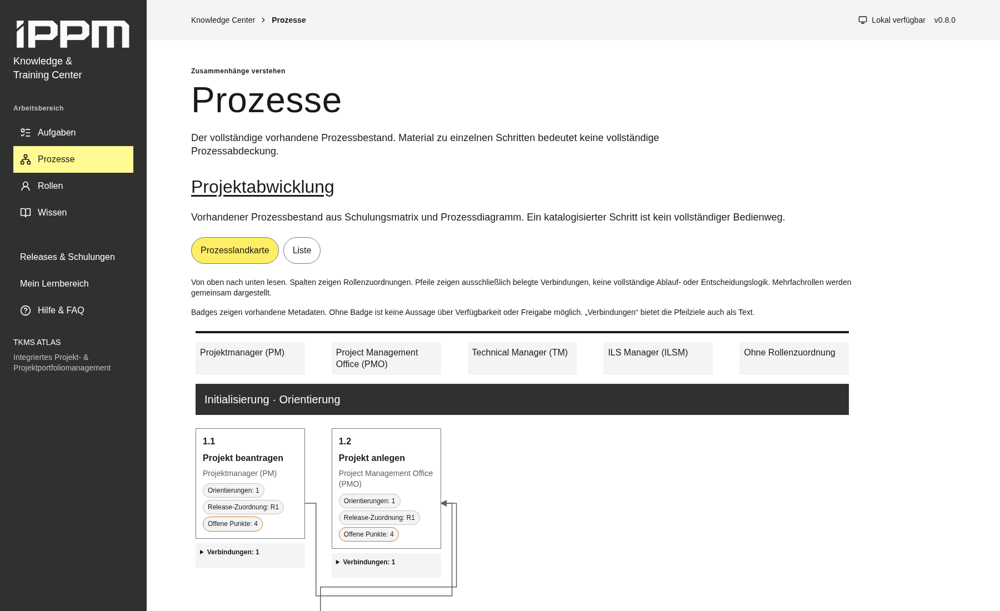
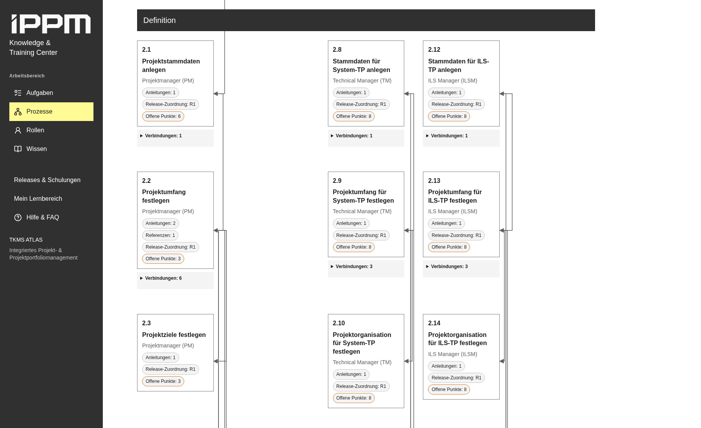
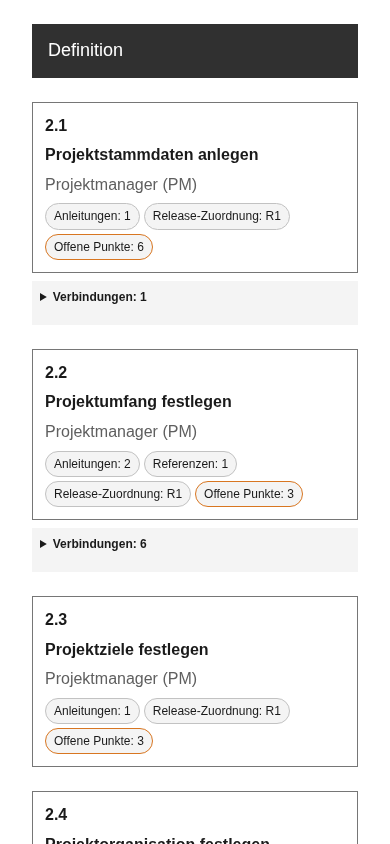
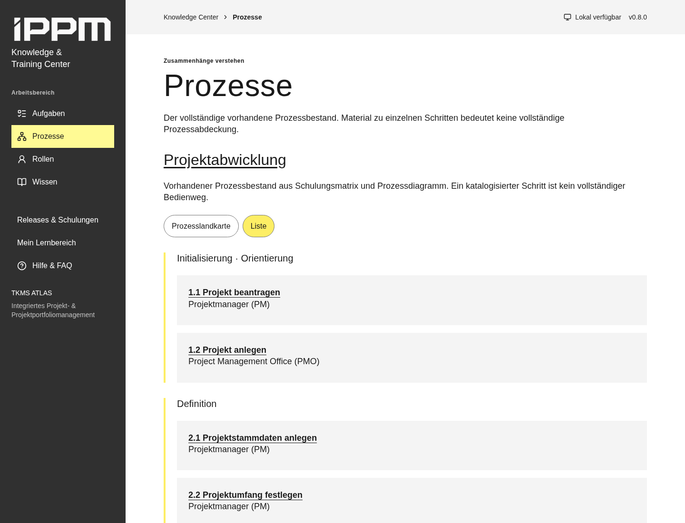
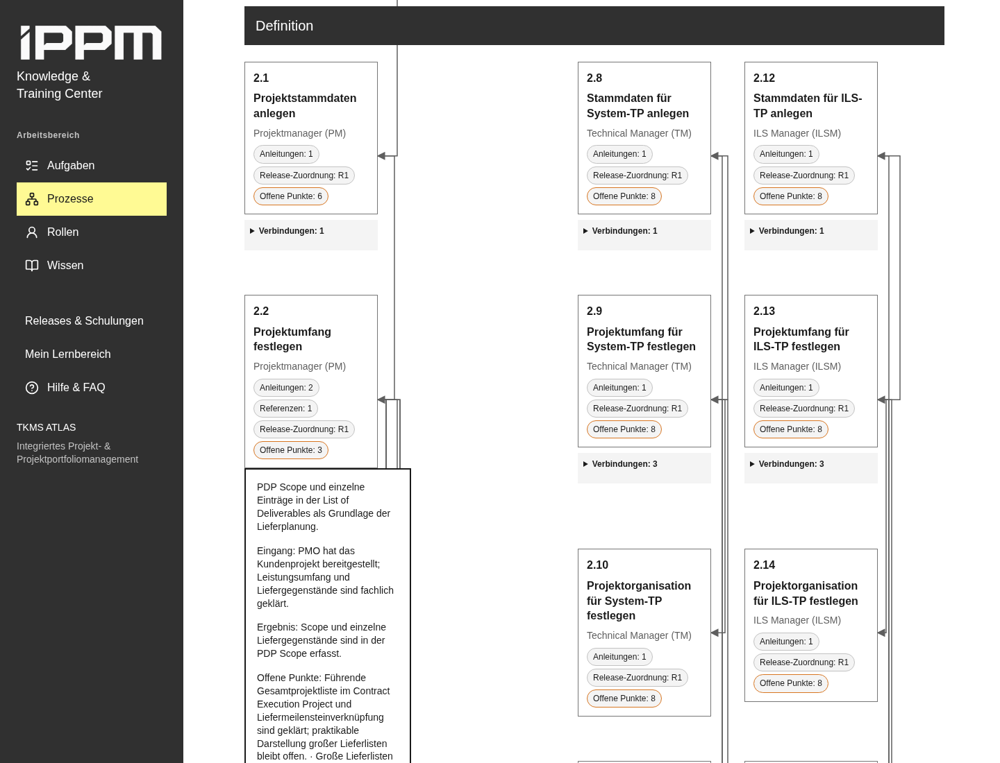

# Prozesslandkarte Projektabwicklung

## Geprüfte Grundlage

Geprüft wurden `AGENTS.md`, `DESIGN.md`, `docs/ROADMAP.md`, Architektur und
Inhaltspflege, `src/content/{types,validation,index}.ts`, der kanonische Prozess,
Rollen, Quellen, Release-/Materialbeziehungen, `src/pages/Processes.tsx`, die
Schrittansicht in `Tasks.tsx`, das Hash-Routing in `App.tsx`, Tokens, Styles und
die vorhandenen Integritäts-, Reader- und Editorprüfungen. Alle Pfade wurden im
aktuellen Repository verifiziert; Ausgangscommit ist `9ae19e7` auf `origin/main`.
Gearbeitet wird auf `feat/process-swimlane-visualization`, ohne Merge.

Die Referenzgrafik ist **`sources/iPPM_Prozess-Projektabwicklung.vsdx`**, keine
separate PNG-Datei. Die Seite heißt `SB01` und liegt in `visio/pages/page1.xml`.
ZIP-/XML-Struktur, Prozess-Shapes, Text, Koordinaten und `Connects` wurden geprüft.
Eine temporäre grafische Rekonstruktion aus Shape-Koordinaten wurde zusätzlich
visuell geprüft; sie ist kein pixelgetreuer Visio-Export und keine neue Quelle.
Die unveränderten Originaldateien werden weiterhin gegen die Migrations-Hashes
geprüft.

## Datenmodell und fachliche Grenzen

- Die 52 bestehenden Schritt-IDs, Nummern, Titel, Phasen, Rollen, Materialien,
  Releases und Schulungszuordnungen sind unverändert. Liste und Karte lesen
  dieselben Objekte aus `processes.json`.
- Neu ist `Process.flows?: ProcessFlow[]` mit `from`, `to`, optional `kind`,
  optional `label` und dem vorhandenen `Sourced`-Quellenvertrag. Endpunkte müssen
  Schritte **desselben** Prozesses sein. Quellenbelege sind für Flows notwendig;
  normale Beiträge brauchen weiterhin keinen Nachweisapparat.
- 66 explizite Visio-Verbinder verbinden zwei eindeutig zugeordnete
  Prozess-Shapes. Zuordnung erfolgt über den vorhandenen Titel, ausschließlich
  mit vereinheitlichtem Whitespace. Jeder Flow nennt `P`, Seite, Verbinder-ID und
  BeginX-/EndX-Shape. Richtung folgt dem expliziten BeginX-/EndX-Endpunktpaar der
  Quelle. Es werden keine Entscheidungsbedingungen oder zusätzlichen Übergänge
  behauptet; `kind` und `label` bleiben mangels weiterer Belege ungesetzt.
- Der automatisierte Quellenvergleich liest die Original-VSDX direkt, prüft
  alle 52 Shape-/Titelzuordnungen und alle 66 expliziten Verbinder gegen die
  kanonischen Flows. Er enthält keine zweite gepflegte Flow- oder Schrittliste.
- `roleIds` meint laut `CONTENT_GUIDE.md` bei Schritten Verantwortungsrollen,
  bei Artikeln Zielgruppen. Mehrere Schrittrollen bleiben gleichberechtigt in
  einer gemeinsamen Spalte; keine wird aus der Arrayposition als führend gewählt.
  Schritte ohne Rolle erhalten eine neutrale Spalte.
- Positive Badges zeigen Anleitungen, Orientierungen, Referenzen, explizite
  Schritt-Releasezuordnungen und zusammengeführte offene Punkte des Schritts und
  seiner fachlichen Tasks, wie in der bestehenden Schrittansicht. Materialien
  werden nicht aus Schulungszuordnungen abgeleitet. Ein fehlender Badge trifft
  keine Aussage über Nichtverfügbarkeit, Nutzbarkeit oder Freigabe.

## Offene fachliche Fragen und nicht übernommene Beziehungen

1. Die Visio-Grafik platziert `5.1 Projekt abschließen` räumlich im PM-Bereich,
   der kanonische Bestand enthält aber ausdrücklich **keine Rolle**, keine
   Release-/Schulungszuordnung und offene Abschlussfragen. Diese Quellenabweichung
   bleibt bestehen; die Karte setzt keine PM-Verantwortung.
2. `3.8 Teilprojektphasen und -meilensteine der TP übernehmen` hat in der Grafik
   einen eingehenden Verbinder von `3.15` (System-TP), jedoch keinen von `3.21`
   (ILS-TP). Ein solcher Übergang wird trotz des breiten Titels nicht ergänzt.
3. Die Zweige zu `2.3`, `2.4`, `2.5`, `2.7`, `2.10`, `2.11`, `2.14`, `2.15` und
   `3.2` besitzen keine weiteren ausgehenden Schrittverbinder. Ein Abschluss,
   eine Zusammenführung oder ein automatischer Übergang wird daraus nicht
   erfunden. Ob solche Beziehungen fehlen, muss fachlich geklärt werden.
4. Visio-Verbinder `779` verbindet Start-Shape `319` mit `1.1`; `596` verbindet
   `5.1` mit End-Shape `670`. Start-/End-Symbole sind keine kanonischen Schritte
   und werden nicht als zusätzliche Schritte oder Flow-Endpunkte angelegt.
5. Rückverbindungen `4.1 → 3.11` (Verbinder `772`) und `4.2 → 3.18` (`771`)
   werden übernommen, weil sie explizit in der Quelle vorliegen. Die Quelle
   belegt keine zusätzlichen Bedingungen oder Entscheidungsrauten dafür.
6. Die bestehenden Quellenkonflikte bei Initialisierung/Projektbeantragung,
   Rechte-/Bestands-Sites, Project Purpose/WBS und Status-/Reporting bleiben als
   offene Punkte und Quellenhinweise am bestehenden Inhalt erhalten. Das
   Diagramm löst keine dieser fachlichen Fragen auf.

## Darstellung und Navigation

`getProcessLayout()` ordnet Rollen in Katalogreihenfolge und Phasen in ihrer
vorhandenen Darstellungsreihenfolge. Pro Phase/Rolle werden Karten deterministisch
platziert. Mehrfachrollen/fehlende Rollen haben eigene neutrale Plätze. Diese
Layoutreihenfolge erzeugt **keine** fachlichen Beziehungen. Layout-Overrides waren
nicht nötig; Fachobjekte enthalten keine Koordinaten oder Inhaltskopien.

Semantische Kartenlinks führen zur bestehenden `/schritt/<id>`-Route; zusätzliche
URL-Parameter erhalten den Karten-/Listenkontext. Der explizite Rücklink und
Browser-Zurück stellen Ansicht, vertikale Position, horizontalen Kartenscroll und
Karten-/Listenfokus während derselben App-Sitzung wieder her. Nach einem Reload
bleibt die Ansicht per URL erhalten, Fokus-/Scrollspeicher wird nicht persistiert.
Der bisherige Aufgabenlink bleibt zusätzlich verfügbar.

SVG-Linien sind orthogonal und liegen in Spaltengassen/Zeilenzwischenräumen.
`ResizeObserver` aktualisiert die Geometrie auch beim Aufklappen von Verbindungen;
Viewportänderungen werden zusätzlich beobachtet. Das SVG blockiert keine
Interaktionen. In dichten Bereichen können Linien sich überlagern oder kreuzen;
die aufklappbare Textdarstellung nennt dieselben eindeutigen Ziele und Belege.

Unter 700 px verfügbarer Containerbreite ersetzt eine kompakte vertikale
Darstellung die breite Rollenansicht. Alle Karten, Rollen, Badges, Kurzinfos und
Textverbindungen bleiben erhalten. Keine Diagrammbibliothek, kein Drag-and-drop,
kein Prozesseditor und keine externen Runtime-Dienste wurden hinzugefügt.

Kurzinfos sind per Hover und Tastaturfokus erreichbar, mit Escape schließbar und
mit dem Pointer erreichbar. Ihre Position ist direkt an der Kartenkante
verankert, unabhängig von der Höhe des Verbindungsbereichs oder der Grid-Zeile.
Der Pointer erreicht sie ohne eine inaktive Lücke; dies wird bei geschlossenen
und geöffneten Verbindungen auf Desktop und Mobilansicht geprüft. Sie kopieren keine Inhalte in eine andere Sammlung.
Die Schrittansicht enthält dieselben Beschreibungen/Eingänge/Ergebnisse/offenen
Punkte, auch für Touchbedienung. Rollen, Nummern, Badgebeschriftungen, Pfeilspitzen
und Textziele tragen die Information unabhängig von Farben.

## Prüfung und Screenshots

- `npm run verify`: erfolgreich; Reader-Build, Editor-Build,
  `typecheck:tools` und **126 Playwright-Prüfungen bestanden** (Integrität,
  Reader/Editor auf Desktop und Mobilansicht, Chromium, ca. 2,5 Minuten).
- `npm run format:check` und `git diff --check`: erfolgreich.
- Neue Prüfungen: ungültige/cross-process Flow-Endpunkte, fehlende Belege,
  Duplikate, Mehrfachrollen, deterministische Platzierung ohne erfundene Flows,
  Original-VSDX-Abgleich, alle 52 Kartenlinks und Karten-/Listenparität,
  URL-/Reload-Verhalten, Tastaturumschaltung, Hover/Fokus-Kurzinfos mit Escape,
  sichtbarer blauer Fokus, Browser-/Link-Rücknavigation mit Scroll-/Fokusrückkehr,
  66 orthogonale Linien ohne Kartenschnitt, Neumessung bei 1440/1800/390 px und
  beim Aufklappen von Verbindungen, kein horizontaler Dokumentüberlauf mobil,
  Axe-Prüfung der Prozessseite, Pointer-Übergang zur Kurzinfo mit geschlossenen
  und geöffneten Verbindungen.
- Screenshots wurden in Chromium erzeugt und visuell geprüft: breite Karte
  (1800 × 1100), Definition mit Pfeilen (1800 × 1100), Kompaktansicht
  (390 × 844) und erhaltene Liste (1440 × 1100).
- Vite meldet weiterhin die nicht blockierende Warnung für JS-Chunks über
  500 kB. Es wurde keine Diagramm- oder andere neue Bibliothek hinzugefügt.
- **Nicht ausgeführt:** Firefox/WebKit, echte Mobilgeräte, Windows-Laufzeit,
  manuelle Screenreaderprüfung und nativer Visio-Export. Automatische Axe-Tests
  und Chromium-Tastaturtests ersetzen keine vollständige manuelle
  Barrierefreiheitsabnahme. Fachliche Bestätigung der oben genannten Fragen
  liegt nicht vor.

